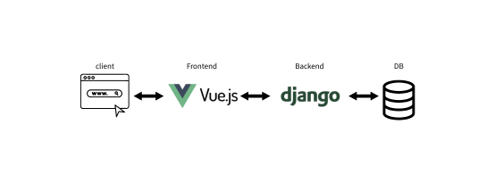
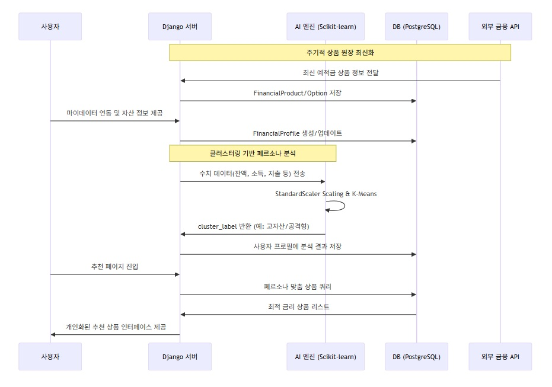
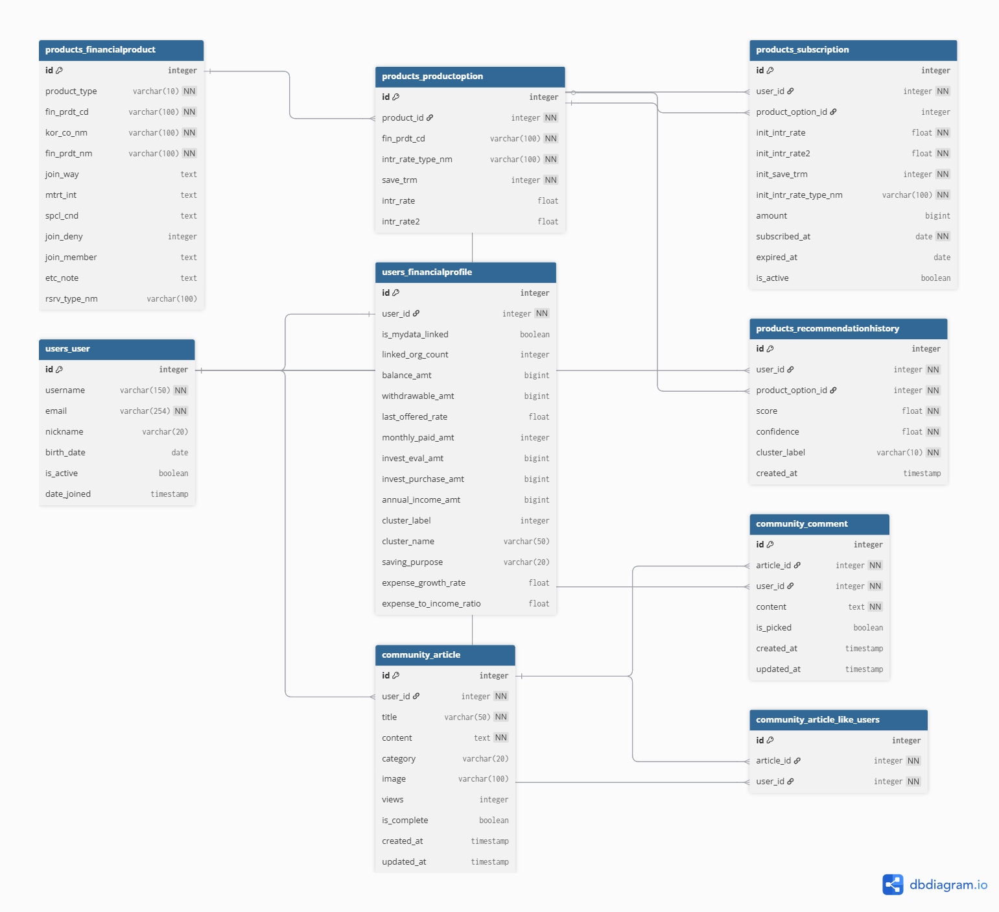
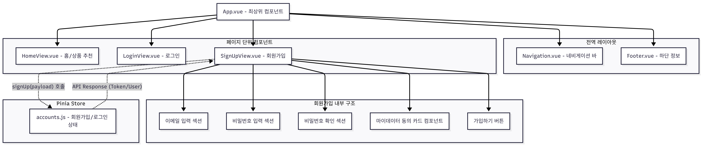
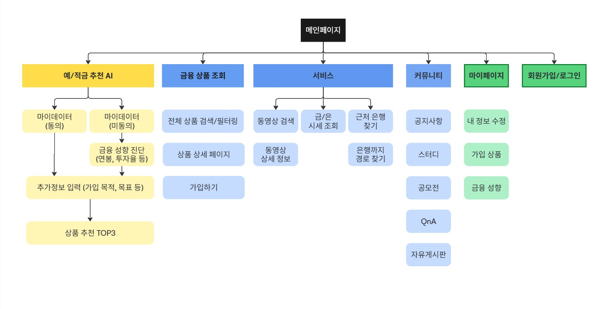

# 💰 머니:비 (Money:B)
> 돈을 비교하다, 머니:비  
> 개인의 금융 상황과 성향을 이해하고, 이유까지 설명해주는 AI 금융상품 추천 서비스

---

## 1. 팀원 정보 및 역할 분담

| 이름 | 역할 | 담당 내용 |
|-----|------|----------|
| 권예지 | 백엔드 / AI | 데이터 수집, 가상 데이터 생성 로직, 추천 알고리즘 설계, 유틸리티 기능(근처 은행 찾기, 관심 종목 검색(youtube API), 금융AI추천 기능, LLM 연동 |
| 이상민 | 프론트엔드 | 화면 설계, 회원가입/로그인(소셜)/로그아웃, 마이페이지 기능, 상품 조회(필터링) 및 가입 기능, 유틸리티 기능(금/은 시세 조회), LLM 연동 |

> 기능 단위 분업을 원칙으로 하되, 초기에는 프론트/백 구조에 대한 책임소재를 명시해 협업 효율을 높였습니다.

---

## 2. 서비스 주요 기능 설명

### 2.1 금융상품 추천
- 사용자 금융 성향(5개) 기반 상품 추천
- 마이데이터 동의 여부에 따라 입력 방식 분기
- 유사도 기반 상위 상품 3개 제공

### 2.2 금융 페르소나 분류
- 금융감독원 기준 참고한 5가지 금융 페르소나
- 분류 결과를 **설명 프레임**으로 활용

### 2.3 AI 금융 리포트 생성
- 추천 결과에 대한 자연어 설명 제공
- 현재 자산 상태 요약 및 주의사항 안내

### 2.4 자연어 기반 추천
- 사용자가 자유롭게 입력한 문장을 해석하여 추천에 반영
- 기존 성향 기반 추천과 결합 (가중치 부여)

---

## 3. 금융 상품 추천 알고리즘 기술적 설명

### 3.1 전체 흐름
1. 사용자 데이터 수집
2. 금융 성향 벡터 생성
3. 금융 상품 벡터와 유사도 계산
4. 상위 상품 필터링
5. LLM을 통한 설명 생성

---

### 3.2 데이터 분기 처리

#### 마이데이터 동의 사용자
- 실제 금융 데이터 기반
  - 소득
  - 소비
  - 잔액
  - 투자 금액

#### 마이데이터 미동의 사용자
- 설문 응답 또는 자연어 입력 기반
- 가상 금융 데이터 생성

---

### 3.3 가상 데이터 생성 로직

현실성을 확보하기 위해 비율 기반 계산 로직 적용

```text
소득 대비
- 소비 비율
- 저축 비율
- 투자 비율
- 금융 페르소나별 평균 비율을 기준으로 사용자 입력값에 가중치 적용

---

## 3.4 추천 방식

본 서비스의 금융상품 추천은 **유사도 기반 추천 방식(Cosine Similarity)**을 사용한다.

사용자의 금융 정보(또는 설문 기반 가상 금융 데이터)를 수치화하여 **사용자 벡터**로 변환하고,  
각 금융 상품 역시 금리, 기간, 위험도 등의 속성을 기반으로 **상품 벡터**로 표현한다.

이후 사용자 벡터와 상품 벡터 간의 코사인 유사도를 계산하여 추천 점수를 산출하며,  
유사도가 높은 상위 N개의 금융 상품을 최종 추천 결과로 제공한다.

해당 방식은 다음과 같은 장점을 가진다.
- 추천 기준이 명확하여 설명 가능성이 높음
- 금융 도메인 특성상 과도한 예측보다 합리적인 비교에 적합
- 사용자 성향 변화에 따라 추천 결과가 자연스럽게 반영됨

---

## 4. 생성형 AI 활용 내용

### 4.1 LLM 활용 목적

본 프로젝트에서 생성형 AI(LLM)는 **추천 판단 로직에는 관여하지 않는다.**

- ❌ 금융 상품 추천 여부 결정
- ❌ 점수 계산 및 랭킹 산출

대신, **추천 결과를 사용자에게 이해시키는 설명 도구**로 활용한다.

- ✔ 추천 결과 요약
- ✔ 금융 성향 설명
- ✔ 사용자 행동을 돕는 가이드 제공

이를 통해 추천 시스템의 **신뢰성과 설명 가능성(Explainability)**을 강화하고자 하였다.

---

### 4.2 생성형 AI 활용 영역

#### 1) 금융 리포트 생성
- 사용자의 자산 상태 및 금융 성향 요약
- 현재 금융 상태의 특징과 주의점 설명
- 확정적 판단이 아닌 가능성 중심의 서술 방식 사용

#### 2) 추천 이유 설명
- 각 금융 상품이 추천된 이유를 자연어로 설명
- 사용자의 금융 성향과 상품 특성 간의 연결 관계를 명확히 제시

#### 3) 넛지(Nudge) 문구 생성
- 사자의 금융 행동을 부드럽게 유도하는 문구 생성
- 과도한 마케팅 표현이나 단정적인 투자 유도 문구는 배제

#### 4) 코드 개선 및 설계 보조
- 복잡한 추천 로직 구조 정리
- API 및 알고리즘 설명 문서화 보조
- 가독성과 유지보수성을 고려한 코드 리팩토링 지원

---

## 5. 팀별 설계

### 5.1 전체 서비스 아키텍처


```
[ Vue Frontend ]
↓
[ Django REST API ]
↓
[ Recommendation Engine ]
↓
[ LLM Module ]
↓
[ Database ]
```


### 5.2. 시퀀스 다이어그램


### 5.3. ERD


### 5.4. 컴포넌트 트리


### 5.5. 정보요구도


### 5.6. 주요기능 화면설계

## 6. 협업 내용
## 협업 방식 및 개발 프로세스

본 프로젝트는 기능 단위 분업과 명확한 커뮤니케이션 구조를 기반으로 협업을 진행하였다.  
초기 기획 단계부터 개발, 테스트, 문서화까지 전 과정에서 협업 툴을 목적에 맞게 분리하여 사용하였다.

---

### 협업 툴 활용

#### Notion
- 프로젝트 전체 문서 허브 역할
- 서비스 기획서, 기능 요구사항 정의서, API 명세, 회의록 관리
- 일정 관리(WBS) 및 진행 상황 체크
- 설계 변경 사항 및 결정 사항 기록

#### Discord
- 실시간 커뮤니케이션 채널
- 기능 구현 중 이슈 공유 및 빠른 피드백
- 개발 진행 상황 공유 및 데일리 소통
- 음성 채널을 활용한 간단한 설계 논의

#### Figma
- UI/UX 설계 및 화면 흐름 공유
- 메인 랜딩 페이지, 추천 결과 화면 등 주요 화면 설계
- 컴포넌트 단위 디자인 정리 및 프론트엔드 구현 기준 제공

#### Miro
- 서비스 구조 시각화 도구
- 사용자 여정(User Journey Map) 정리
- 서비스 흐름도, 아키텍처 다이어그램, 추천 로직 구조 정리
- 복잡한 로직을 팀원 간 직관적으로 공유하는 용도로 활용

---

### Git 협업 방식

#### 브랜치 전략

기본적으로 **기능 단위 브랜치 전략**을 사용하였다.

- `main`  
  - 배포 및 안정 버전 관리
- `develop`  
  - 통합 개발 브랜치
- `feature/*`  
  - 기능별 개발 브랜치  
  - 예: `feature/recommendation`, `feature/survey`, `feature/llm-report`

각 기능 개발은 `feature` 브랜치에서 진행한 후,  
리뷰 및 테스트를 거쳐 `develop` 브랜치로 병합하였다.

---

#### Commit 규칙

커밋 메시지는 작업 내용을 명확히 파악할 수 있도록 **의미 단위 커밋**을 원칙으로 하였다.

- `feat`: 새로운 기능 추가
- `fix`: 버그 수정
- `refactor`: 리팩토링
- `docs`: 문서 수정
- `style`: 코드 포맷 수정 (로직 변경 없음)

### 소회
권예지: 주어진 시간 내에 해야 하는 우선순위 설정이나 설계에 대해 많이 생각해보게 되었다. 당연히 기능은 고도화되면 좋겠지만 정해진 일정 내에 업무를 수행하는 것 또한 마찬가지로 중요하다고 생각했다.
생성형 AI가 만연해진 시기에 정말 만만하게 봤다. 도구를 사용하는 것 역시 기본지식이 받쳐줘야 시너지 효과가 난다는 것을 새삼 깨달았다. 그래도 그동안 배운 웹 개발 AI를 동시에, 추가로 금융 도메인의 좋은 프로젝트를 할 수 있어 좋은 경험이었다. 
이상민:  초기 ERD 다이어그램을 그리는 것과 모델 구성의 중요성을 느꼈습니다. 프로젝트를 진행하면서 세부 조건에 맞추기 위해 필드를 수정할 일이 많았습니다. 필드를 수정하는 것은 상대적으로 괜찮았지만 모델의 큰 구조, 위치 혹은 시리얼라이저 등을 바꾸게 되는 경우에는 수정해야할 부분이 굉장히 많았고 어려움이 있었습니다. 그나마 팀장이 저보다 훨씬 꼼꼼하게 기획, 설계를 해준 덕에 일이 줄었습니다. 그래도 여러번 수정도 하고, DB 구조를 생각해보면서 실제 프로젝트 개발에서 어떤 점들을 고려해야 하는지 배울 수 있었고 연습도 됐습니다. 
